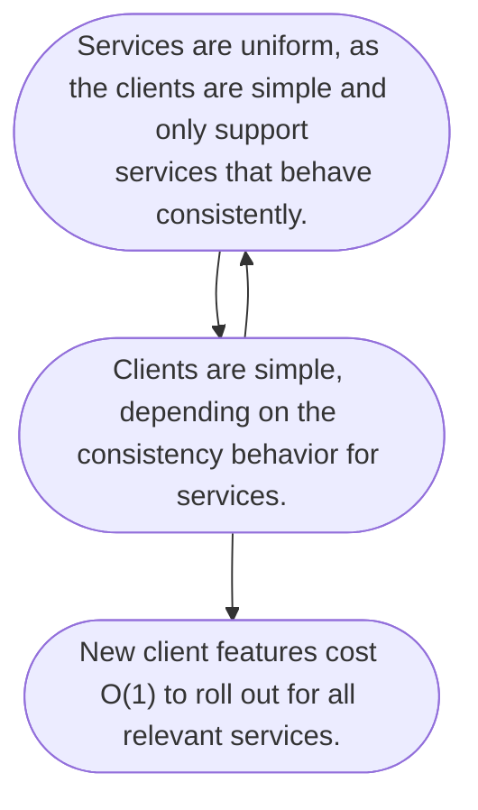

I've been doing a lot of work on platforms recently, specifically to how it pertains to clients. A general concept has solidified for me: a "uniformity cycle" and a "complexity cycle", and without an intentional philosophy can fall into one naturally.

## Platforms and Clients

For this post, I'm using "platform" to refer to more than one service that together provides functionality or value to a customer. Think clouds where compute, disks, blob storage, and databases are provided and interoperate with each other. Or GitHub which provides repositories, issue tracking, project management tooling, and continuous integration.

These services are designed to interoperate with each other, and often come with a set of shared *clients* that consume them. Think command lines, visual user interfaces, and SDKs in various languages.

## The Complexity Cycle

Clients start out very simple: there are usually a small handful of services that exist, and the integration occurs manually. Not a lot of thought is given into what is sharable or not at this phase, sans common industry wide standards like HTTP or authentication. The services have autonomy, and the integration cost with clients seems marginal to an organization since the feature set is small.

However, as time goes on, this cost of client-server integration becomes costly.
What's worse, if there's a desire to introduce some common feature in a client
for *all* services, it is difficult to do so since every client is hand-coded. For example, if generic functionality around listing resources is desired, it must be added to every integration, and must be integrated by hand as likely the service's implementation of listing resources differs.

Since everything in the clients is hand-written, there is little value in developing standard behavior, so services continue to implement differing functionality that serves a similar purpose.

 This whole loop is an example of what I'm calling a "complexity cycle":


graph TD
  x(["Services vary in behavior, since integrations are hand-coded and there
    is no value in building or following standards."])
  y(["
    Clients are hand-coded as services vary in behavior.
  "])
  z(["New clients features take a long time to create
  due to variation in service behavior."])
  x --> y
  y --> x
  y --> z


## The Uniformity Cycle

So how do we address this cycle of complexity, that will erode the value of a
common platform? By promoting (or sometimes enforcing) *uniformity*.

If non-uniform schema or behavior makes it harder for clients to integrate with
services, then more uniform schema behavior reduces the cost. If the client
depends *only* on uniform behavior, then the clients are extremely simple to
maintain and author: their cost is effectively O(1) to integrate with all
compliance services.

This in turn motivates the services themselves to be more consistent: new services, as they are created, *must* adhere to the uniformity requirements (even if implicit) as the clients do not allow configuration or hand-written code.

This opposite a complexity cycle can be described as a "uniformity cycle":

A uniformity cycle can keep costs low across both services and clients:

- As services must have more uniform behavior, more shared platforms can be created to reduce the cost of these features (e.g. auth or storing state)
- New universal service features are also easier to roll out, as they rely more on a shared platform.

## How to flip the cycle

Reversing the cycle from complexity to uniformity requires a strategy that spans across both the platform and it's clients. Oftentimes a single individual does not have the ability to flip things, nor does a single change flip the cycle.

But several patterns exist, including:

- When supporting new features in a client using new server behavior (e.g. filtering on a list), require a specific implementation of that behavior. When asked to support a different implementation, have a hard design discussion on why, and try to fold any requirements back into the existing implementation.
- Build fast feedback service-client loops: if service producers can see the
  direct impact on the clients and see undesirable behaviors, they can change them in the service early on in the cycle rather than right at the end when the team has deadlines.
- Build common behavior into existing shared infrastructure such that services do not have control over the implementation: API gateways are a great place to introduce new features.

After time, the cycle can flip.

## Should we always design for uniformity?

No. It is a common case for the need to diverge in behavior to be justified, and a necessity for a platform to become more configurable to address it.

However, it is best to *minimize* the variation for the services and the amount of flexible handling in the client.